# T & T Fashion Store

## Final Project Report

---

## University of Lay Adventists of Kigali (UNILAK)

### Faculty of Computing and Information Sciences

### Course Code
**EWA408510**

### Course Title
**E-Commerce and Web Application**

---

# T & T Fashion Store

## A Complete E-Commerce Web Application Developed Using PHP and MySQL

---

### Submitted By

**Student Name:** Timothy Keita

**Registration Number:** 23528/2023

---

### Submitted To

**Lecturer:** Eric Maniraguha

---

### Academic Year

**2025–2026**

---

# Table of Contents

1. Introduction
2. Project Background
3. Problem Statement
4. Project Objectives
5. Scope of the Project
6. System Features
7. Functional Requirements
8. Non-Functional Requirements
9. Technologies Used
10. Project Structure
11. Database Design
12. System Workflow
13. Customer Module
14. Administrator Module
15. Security Features
16. Docker Implementation
17. GitHub Repository
18. Continuous Integration (CI/CD)
19. Installation Guide
20. Screenshots
21. Challenges Encountered
22. Future Enhancements
23. Conclusion
24. References

---

# 1. Introduction

The rapid growth of electronic commerce has transformed the way customers purchase products and how businesses manage their daily operations. Traditional shopping methods require customers to physically visit stores, which can be time-consuming and inconvenient. E-commerce platforms provide a modern solution by enabling customers to browse products, place orders, and make purchases online from anywhere with internet access.

The **T & T Fashion Store** is a web-based e-commerce application designed to provide customers with a convenient online shopping experience while enabling administrators to efficiently manage products, customer orders, inventory, and sales information.

This project was developed using PHP, MySQL, HTML5, CSS3, JavaScript, and Bootstrap 5. It demonstrates the practical application of web development concepts studied in the E-Commerce and Web Application course.

---

# 2. Project Background

Many small and medium-sized fashion businesses still rely on manual methods to manage products, customers, and sales. These manual processes often result in slow service delivery, poor record keeping, inventory management problems, and reduced customer satisfaction.

The T & T Fashion Store was developed to address these challenges by providing a centralized online platform where customers can browse fashion products, add items to a shopping cart, complete purchases, and track their orders. At the same time, administrators can efficiently manage products, categories, customers, and reports through a secure administrative dashboard.

The project demonstrates how modern web technologies can be applied to improve business efficiency, customer satisfaction, and overall operational effectiveness.

---

# 3. Problem Statement

Many fashion stores experience several operational challenges due to the absence of an online management system. Customers must physically visit stores to view available products, compare prices, and make purchases. This approach limits accessibility and often leads to reduced sales opportunities.

Store administrators also face difficulties in managing inventory, processing customer orders, generating reports, and maintaining accurate customer records. Manual processes increase the likelihood of errors and consume significant time.

The T & T Fashion Store was developed to solve these problems by providing an integrated online platform that simplifies shopping, improves administrative efficiency, and enhances customer experience.

---

# 4. Project Objectives

## 4.1 General Objective

To develop a secure, responsive, and user-friendly e-commerce web application that enables customers to purchase fashion products online while allowing administrators to efficiently manage the store's daily operations.

## 4.2 Specific Objectives

- To develop an attractive and responsive website interface.
- To provide customers with an online shopping platform.
- To implement a secure customer registration and login system.
- To allow customers to add products to a shopping cart.
- To implement a complete checkout process.
- To enable administrators to manage products and categories.
- To provide customer management functionality.
- To implement order management.
- To generate administrative reports.
- To maintain website settings through an administration panel.

---

# 5. Scope of the Project

The scope of the T & T Fashion Store includes both customer and administrator functionalities.

For customers, the system provides product browsing, category filtering, shopping cart management, customer registration, secure login, checkout, and order history.

For administrators, the system provides product management, category management, customer management, order management, report generation, website settings, customer support management, review management, and profile management.

The project focuses on demonstrating core e-commerce concepts rather than integrating external online payment gateways.

---

# 6. System Features

The T & T Fashion Store provides comprehensive functionality for both customers and administrators. The system was designed to provide a simple, secure, and efficient shopping experience while giving administrators complete control over the online store.

## 6.1 Customer Features

The customer module allows users to:

- Browse available fashion products.
- View detailed product information.
- Search products by category.
- Add products to the shopping cart.
- Update item quantities in the cart.
- Remove unwanted items from the cart.
- Register a new customer account.
- Log in securely using their credentials.
- Complete the checkout process.
- View previous orders.
- Update personal profile information.
- Contact the store through the contact page.

## 6.2 Administrator Features

The administrator module provides complete management of the online store.

The administrator can:

- Access a secure administrator dashboard.
- Add new products.
- Edit existing products.
- Delete products.
- Upload product images.
- Manage product categories.
- View and process customer orders.
- Manage customer accounts.
- View customer reviews.
- Respond to customer support requests.
- Generate reports.
- Manage website settings.
- Update administrator profile information.

---

# 7. Functional Requirements

Functional requirements describe the services that the system must provide to its users.

## 7.1 User Authentication

The system shall:

- Allow customers to register.
- Allow customers to log in.
- Allow administrators to log in securely.
- Allow users to log out.
- Restrict unauthorized access to protected pages.

## 7.2 Product Management

The system shall:

- Display available products.
- Display product images.
- Display product prices.
- Display product descriptions.
- Allow administrators to add products.
- Allow administrators to update products.
- Allow administrators to delete products.

## 7.3 Category Management

The system shall:

- Display product categories.
- Allow administrators to add categories.
- Allow administrators to edit categories.
- Allow administrators to delete categories.

## 7.4 Shopping Cart

The system shall:

- Add products to the shopping cart.
- Update product quantities.
- Remove products.
- Calculate the total amount automatically.

## 7.5 Checkout

The system shall:

- Collect customer delivery information.
- Display the order summary.
- Save customer orders into the database.
- Generate an order confirmation.

## 7.6 Order Management

The administrator shall:

- View all customer orders.
- Update order status.
- Monitor completed and pending orders.

## 7.7 Customer Management

The administrator shall:

- View customer accounts.
- Manage customer information.
- Monitor customer activities.

## 7.8 Reports

The system shall generate reports showing:

- Total products.
- Total categories.
- Total customers.
- Total orders.
- Sales statistics.

---

# 8. Non-Functional Requirements

Non-functional requirements describe how the system performs its functions.

## Performance

The system should load pages quickly and process customer requests efficiently.

## Reliability

The application should operate correctly without unexpected failures during normal use.

## Usability

The user interface should be simple, intuitive, and easy to navigate for both customers and administrators.

## Security

The application should protect user information through secure authentication, password hashing, session management, and input validation.

## Maintainability

The source code should be organized into logical folders to simplify future updates and maintenance.

## Scalability

The application should support future enhancements such as online payment integration, delivery tracking, and inventory management.

## Compatibility

The system should function correctly on modern web browsers including:

- Google Chrome
- Microsoft Edge
- Mozilla Firefox
- Opera

The website is also designed to be responsive for desktop and mobile devices.

---

# 9. Technologies Used

The project was developed using several modern web technologies.

| Technology | Purpose |
|------------|---------|
| HTML5 | Structure of web pages |
| CSS3 | Styling and layout |
| Bootstrap 5 | Responsive user interface |
| JavaScript | Interactive features and client-side validation |
| PHP | Server-side programming |
| MySQL | Database management |
| Bootstrap Icons | Icons used throughout the application |
| Git | Version control |
| GitHub | Source code hosting |
| Docker | Containerization and deployment |

## HTML5

HTML5 was used to create the structure of every webpage including forms, navigation menus, tables, and content sections.

## CSS3

CSS3 was used to design an attractive and responsive interface while ensuring consistency throughout the application.

## Bootstrap 5

Bootstrap 5 provided responsive layouts, cards, navigation bars, buttons, tables, forms, and utility classes, reducing development time and improving user experience.

## JavaScript

JavaScript was used to improve interactivity by validating forms, enhancing the user interface, and providing dynamic behavior.

## PHP

PHP serves as the server-side programming language responsible for:

- User authentication
- Session management
- Product management
- Order processing
- Database communication
- Business logic

## MySQL

MySQL stores all application data including:

- Administrator accounts
- Customer accounts
- Products
- Categories
- Orders
- Reviews
- Website settings

## Git and GitHub

Git was used for version control, while GitHub was used to host the project's source code and documentation.

## Docker

Docker simplifies deployment by packaging the application and its dependencies into containers, ensuring consistent execution across different environments.

---

# 10. Project Structure

The project follows a modular directory structure to improve organization and maintainability.

```
T-T-Fashion-Store/
│
├── admin/
├── assets/
│   ├── css/
│   ├── js/
│   ├── images/
│
├── config/
├── customer/
├── database/
├── includes/
├── screenshots/
├── Dockerfile
├── docker-compose.yml
├── README.md
└── index.php
```

## Folder Description

### admin/

Contains all administrator pages including the dashboard, product management, category management, customer management, reports, settings, and profile pages.

### assets/

Stores static resources such as CSS stylesheets, JavaScript files, icons, logos, and uploaded images.

### config/

Contains configuration files including database connection settings, authentication, constants, and other system configurations.

### customer/

Contains all customer-related pages including login, registration, profile management, checkout, and order history.

### database/

Stores the SQL database export used to create the application's database structure.

### includes/

Contains reusable PHP components such as the navigation bar, sidebar, footer, header, and other shared layouts.

### screenshots/

Contains screenshots of the completed system that are referenced in this documentation.

---

# 11. Database Design

## 11.1 Database Overview

The T & T Fashion Store uses MySQL as its relational database management system. The database stores all information required for the operation of the online store, including administrator accounts, customer accounts, products, categories, orders, shopping carts, reviews, and website settings.

The database was designed to minimize data redundancy while maintaining data integrity through the use of primary keys and relationships between tables.

## 11.2 Main Database Tables

The application consists of the following primary tables:

| Table Name | Description |
|------------|-------------|
| admins | Stores administrator login credentials and profile information. |
| customers | Stores customer registration details. |
| categories | Stores available product categories. |
| products | Stores all products displayed in the store. |
| orders | Stores customer orders. |
| order_items | Stores products belonging to each order. |
| reviews | Stores customer reviews and ratings. |
| support_messages | Stores customer inquiries and support requests. |
| settings | Stores website configuration information. |

## 11.3 Database Relationships

The database follows a relational design.

- One category can contain many products.
- One customer can place multiple orders.
- One order can contain multiple products.
- One administrator manages products, categories, and customer orders.

This design ensures consistency, reduces duplication of data, and improves system performance.

---

# 12. System Workflow

The overall workflow of the application is divided into two major modules: the Customer Module and the Administrator Module.

## 12.1 Customer Workflow

The customer performs the following sequence of actions:

1. Visit the home page.
2. Browse available products.
3. View product details.
4. Add products to the shopping cart.
5. Register or log in.
6. Proceed to checkout.
7. Confirm the order.
8. View order history.

This workflow provides a simple and user-friendly shopping experience.

## 12.2 Administrator Workflow

The administrator performs the following activities:

1. Log into the admin dashboard.
2. Add or update products.
3. Manage product categories.
4. View customer orders.
5. Update order status.
6. Manage customer accounts.
7. View reports.
8. Update website settings.

---

# 13. Customer Module

The Customer Module provides all services available to customers visiting the website.

## Home Page

The home page displays featured products, promotional banners, navigation links, and quick access to different product categories.

## Product Catalogue

Customers can browse all available fashion products together with images, prices, and descriptions.

## Product Details

Each product has a dedicated page displaying additional information such as price, description, category, and image.

## Shopping Cart

Customers can add products to their shopping cart, modify quantities, remove unwanted products, and view the total cost before checkout.

## Customer Registration

New users can create customer accounts by providing their personal information.

## Customer Login

Registered customers can securely log into the system using their email address and password.

## Checkout

The checkout page collects delivery information, verifies the order, and stores the completed transaction in the database.

## Order History

Customers can view previously completed orders through their dashboard.

---

# 14. Administrator Module

The Administrator Module provides complete control over the online store.

## Admin Dashboard

The dashboard displays system statistics including:

- Total Products
- Total Categories
- Total Customers
- Total Orders
- Sales Summary

It provides administrators with an overview of store performance.

## Product Management

Administrators can:

- Add products
- Edit products
- Delete products
- Upload product images
- Manage product availability

## Category Management

The administrator can create, modify, or remove product categories.

## Order Management

Orders submitted by customers are displayed in the dashboard where administrators can process and update their status.

## Customer Management

Administrators can monitor customer accounts and review customer activity.

## Reports

The reporting module generates useful business information including:

- Sales reports
- Customer reports
- Product reports
- Order reports

## Reviews

Administrators can monitor customer reviews and feedback submitted through the website.

## Support Centre

Customer support messages are displayed for administrators to review and respond appropriately.

## Website Settings

This module allows administrators to update:

- Website name
- Logo
- Contact information
- Social media links
- Other system settings

---

# 15. Security Features

Security was an important consideration during the development of the application.

The following security measures were implemented:

## Password Hashing

Customer and administrator passwords are securely stored using password hashing instead of plain text.

## Session Management

PHP sessions are used to authenticate users and restrict unauthorized access to protected pages.

## Authentication

Only authenticated users are allowed to access customer dashboards and administrator pages.

## Input Validation

User input is validated before processing to reduce invalid data entry.

## SQL Injection Prevention

Prepared statements and proper database handling techniques are used where applicable to reduce SQL injection risks.

## Access Control

Administrative pages require administrator authentication before access is granted.

---

# 16. Testing

Testing was carried out throughout the development process to ensure that each component functioned correctly.

## Functional Testing

The following functionalities were successfully tested:

| Function | Status |
|----------|--------|
| Customer Registration | Passed |
| Customer Login | Passed |
| Product Listing | Passed |
| Product Details | Passed |
| Shopping Cart | Passed |
| Checkout | Passed |
| Order Management | Passed |
| Product Management | Passed |
| Category Management | Passed |
| Reports | Passed |
| Website Settings | Passed |

## Browser Compatibility Testing

The application was tested successfully using:

- Google Chrome
- Microsoft Edge
- Mozilla Firefox

The responsive layout was also verified on desktop and mobile screen sizes.

---

# 17. Docker Implementation

Docker was used to package the application into containers, making it easier to deploy and run consistently across different environments.

## Docker Components

The project includes the following Docker configuration files:

- Dockerfile
- docker-compose.yml

The Dockerfile defines how the PHP application is built, while the docker-compose.yml file coordinates the application and database services.

## Benefits of Docker

The use of Docker provides several advantages:

- Consistent development and deployment environments.
- Simplified application setup.
- Easy portability across different operating systems.
- Reduced dependency conflicts.
- Improved scalability for future deployment.

---

# 18. GitHub Repository

Version control for this project was managed using Git, while GitHub was used as the online repository for source code management and collaboration.

The repository contains:

- Complete project source code.
- Database files.
- Docker configuration.
- Documentation.
- Screenshots.
- README documentation.

Repository Link:

**https://github.com/timothkeita/t-t-fashion-store**

GitHub was also used to track project changes and maintain version history throughout development.

---

# 19. Continuous Integration (CI/CD)

Continuous Integration and Continuous Deployment (CI/CD) improve software quality by automatically building and testing applications whenever changes are pushed to the repository.

For this project, GitHub Actions can be used to automate the development workflow.

Typical CI/CD tasks include:

- Automatic source code checkout.
- PHP syntax validation.
- Build verification.
- Docker image creation.
- Deployment preparation.

The implementation of CI/CD demonstrates the use of modern software engineering practices and prepares the project for future automated deployment.

---

# 20. Installation Guide

Follow the steps below to install and run the project locally.

## Step 1

Clone the repository.

```bash
git clone https://github.com/timothkeita/t-t-fashion-store.git
```

## Step 2

Move the project folder into the XAMPP `htdocs` directory.

## Step 3

Start Apache and MySQL using the XAMPP Control Panel.

## Step 4

Open phpMyAdmin and create a new database.

Example:

```
t_t_fashion_store
```

## Step 5

Import the SQL file located inside the `database` folder.

## Step 6

Update the database connection details inside:

```
config/db.php
```

## Step 7

Open the project in your browser.

```
http://localhost/T-T-Fashion-Store
```

The application should now be running successfully.

---

# 21. System Screenshots

The following screenshots demonstrate the major functionalities of the **T & T Fashion Store** web application.

---

## Figure 1: Home Page

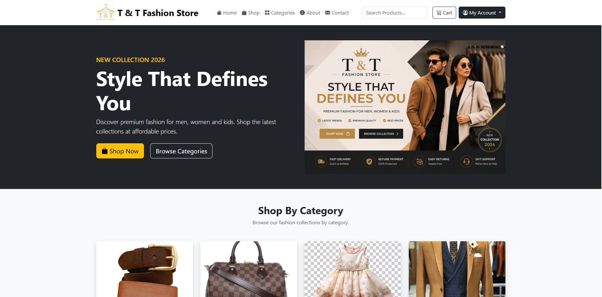

The Home Page serves as the entry point of the application. It welcomes visitors, showcases featured fashion products, and provides easy navigation to the Products, Categories, About, Contact, Cart, and Customer Login pages.

---

## Figure 2: Product Listing

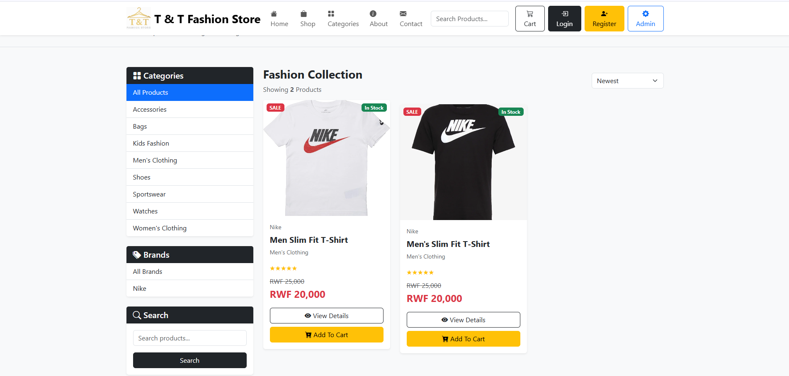

The Product Listing page displays all available fashion products together with their images, prices, categories, and short descriptions. Customers can browse products and select items they wish to purchase.

---

## Figure 3: Product Details

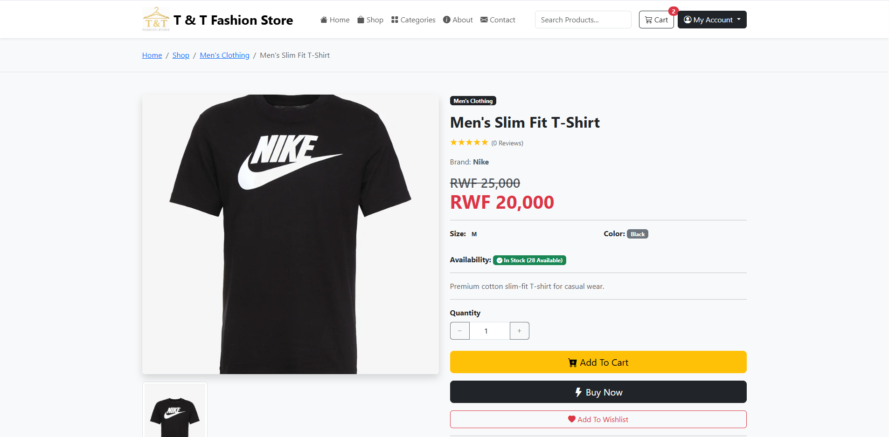

The Product Details page provides comprehensive information about a selected product, including its image, price, description, category, and an option to add the product to the shopping cart.

---

## Figure 4: Shopping Cart

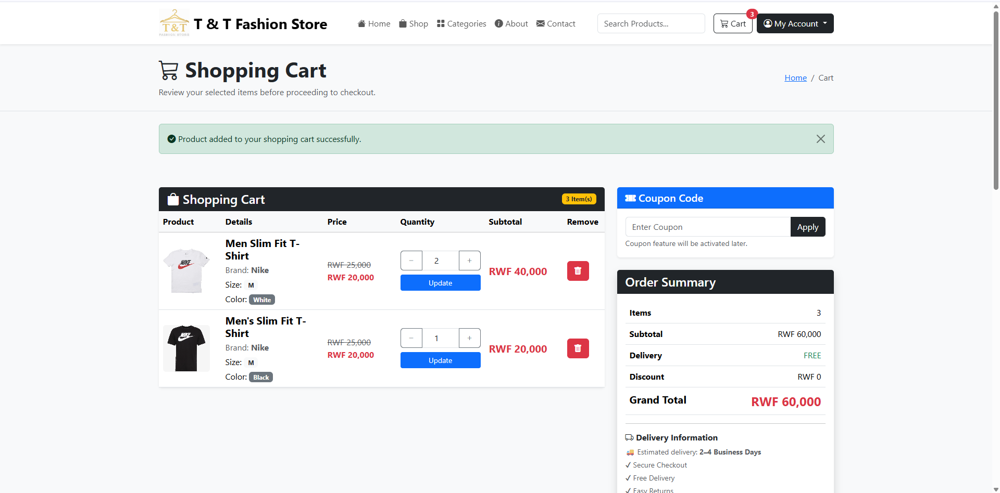

The Shopping Cart allows customers to review selected products, update quantities, remove unwanted items, and view the total cost before proceeding to checkout.

---

## Figure 5: Checkout Page

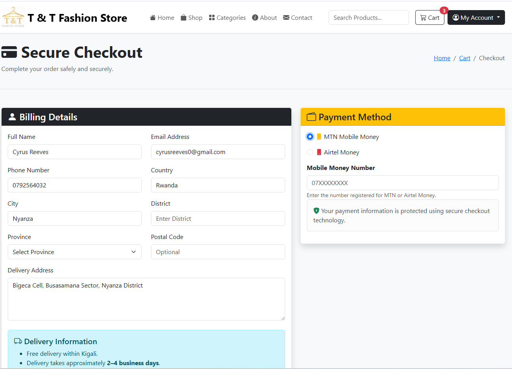

The Checkout page enables customers to confirm their orders by providing delivery information and reviewing their order summary before completing the purchase.

---

## Figure 6: Customer Login

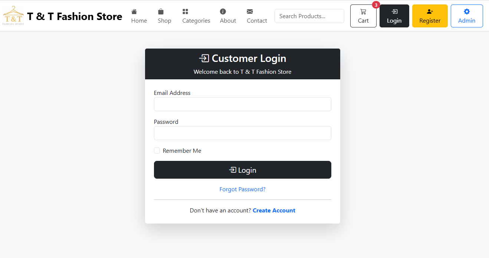

The Customer Login page provides secure authentication for registered users, allowing them to access their accounts, manage orders, and update personal information.

---

## Figure 7: Administrator Dashboard

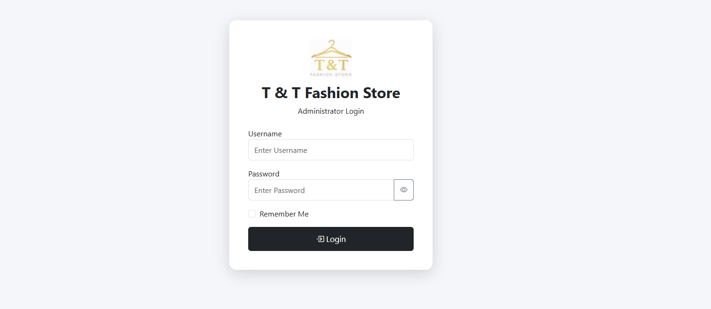

The Administrator Dashboard provides an overview of the system by displaying important statistics such as the total number of products, categories, customers, and orders. It also offers quick access to administrative functions.

---

## Figure 8: Product Management

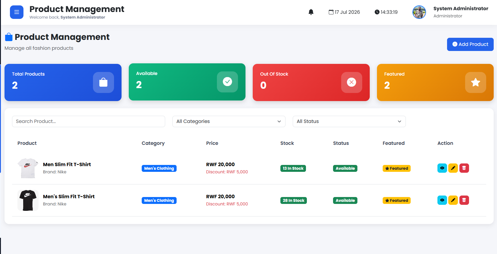

The Product Management page enables administrators to add new products, edit existing products, delete products, upload images, and manage product information efficiently.

---

## Figure 9: Order Management

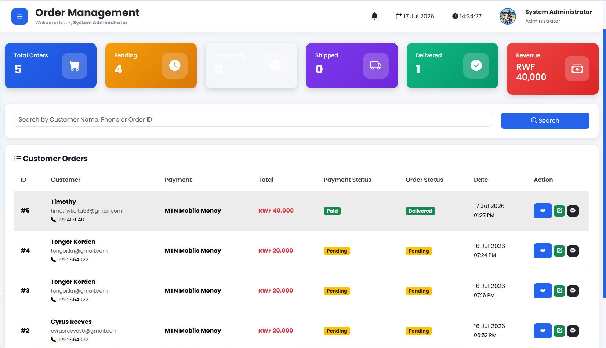

The Order Management page displays all customer orders, allowing administrators to review order details, update order status, and monitor sales activities.

---

## Figure 10: Customer Management

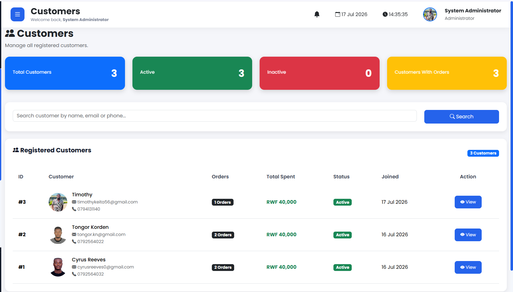

The Customer Management page provides administrators with access to customer records, enabling them to monitor registered users and manage customer information.

---

## Figure 11: Reports

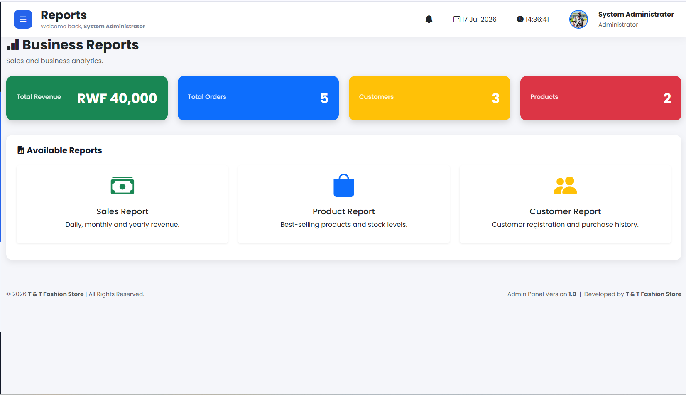

The Reports page presents useful business information, including sales statistics, customer reports, and order summaries, assisting administrators in making informed decisions.

---

## Figure 12: Website Settings

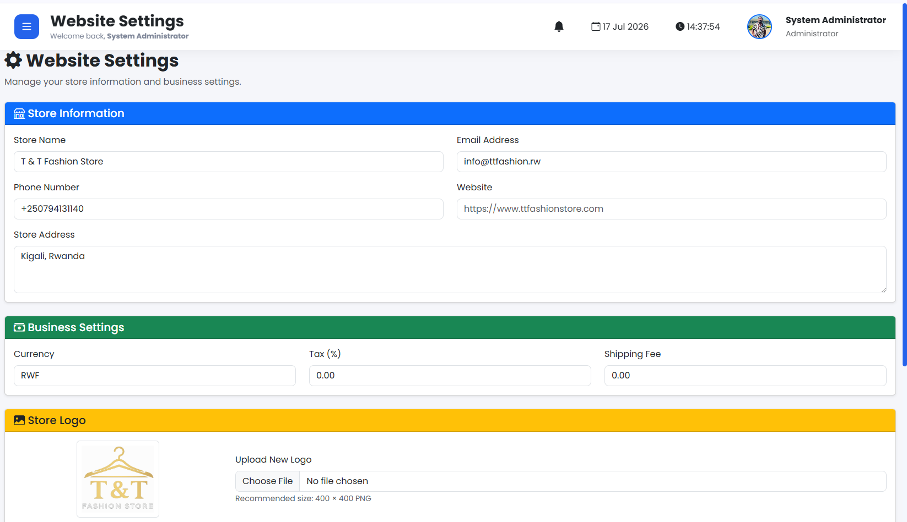

The Website Settings page allows administrators to configure various aspects of the online store, including the website name, logo, contact information, and other system settings.

---

# 22. Challenges Encountered

During the development of the T & T Fashion Store, several challenges were encountered.

Some of the major challenges included:

- Designing a responsive user interface.
- Managing relationships between database tables.
- Handling user authentication securely.
- Managing file uploads for product images.
- Configuring Docker for the application.
- Organizing reusable PHP components.
- Debugging database connection and session-related issues.
- Ensuring consistent styling across all pages.

Each challenge provided valuable learning experiences and contributed to improving both programming and problem-solving skills.

---

# 23. Future Enhancements

Although the application successfully meets its objectives, several improvements can be implemented in future versions.

Possible enhancements include:

- Integration with online payment gateways such as PayPal and Stripe.
- Email notifications for customer orders.
- SMS notifications.
- Product search with advanced filters.
- Wishlist functionality.
- Product comparison.
- Inventory management.
- Discount and coupon system.
- Sales analytics dashboard.
- Multi-language support.
- Customer live chat.
- Mobile application integration.

These improvements would further enhance usability and business efficiency.

---

# 24. Conclusion

The T & T Fashion Store project successfully demonstrates the practical application of web development technologies in building a complete e-commerce system.

The application provides customers with a convenient online shopping platform while enabling administrators to manage products, categories, customers, orders, reports, and website settings through a secure dashboard.

Throughout the development of this project, valuable skills were gained in PHP programming, MySQL database design, responsive web design, session management, version control using Git and GitHub, and containerization using Docker.

Overall, the project satisfies the objectives of the E-Commerce and Web Application course and demonstrates the successful implementation of a modern web-based e-commerce solution.

---

# 25. References

The following resources were consulted during the development of this project.

1. PHP Documentation. https://www.php.net/docs.php

2. MySQL Documentation. https://dev.mysql.com/doc/

3. Bootstrap Documentation. https://getbootstrap.com/docs/

4. HTML Living Standard. https://html.spec.whatwg.org/

5. CSS Specifications. https://www.w3.org/Style/CSS/

6. JavaScript Documentation (MDN). https://developer.mozilla.org/

7. Git Documentation. https://git-scm.com/doc

8. GitHub Documentation. https://docs.github.com/

9. Docker Documentation. https://docs.docker.com/

10. Visual Studio Code Documentation. https://code.visualstudio.com/docs

---

# Acknowledgement

I sincerely thank **Mr. Eric Maniraguha**, the lecturer for the E-Commerce and Web Application course, for his guidance, encouragement, and valuable knowledge throughout the development of this project.

I also extend my gratitude to the Faculty of Computing and Information Sciences at the University of Lay Adventists of Kigali (UNILAK) for providing the opportunity to apply theoretical knowledge to a practical software development project.

Finally, I appreciate my colleagues, friends, and family for their continuous support and motivation throughout the completion of this project.

---

**End of Report**